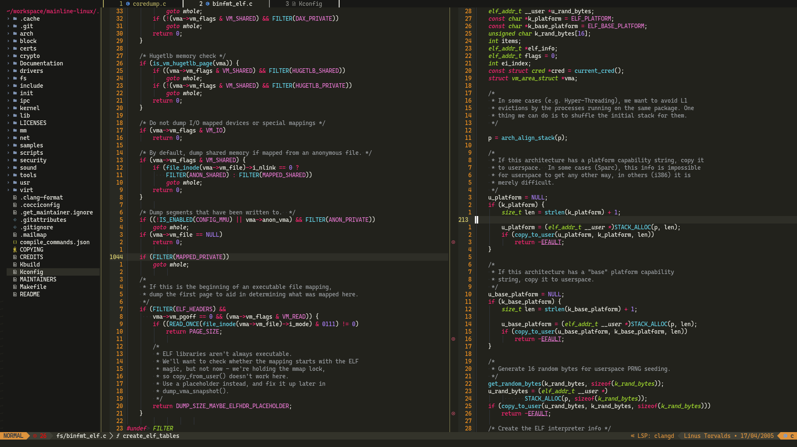

# [Neovim (nvim)](https://github.com/neovim/neovim) 배우기



---

# Neovim(nvim)이란 무엇인가요?

Neovim은 Vim의 포크(fork)로 LSP 클라이언트와 Lua API를 통합하여 설정 및 플러그인 생성을 지원합니다. nvim의 커뮤니티는 잘 설계되고, 견고하며, 확장 가능하고, 대체 가능한 다양한 [플러그인 생태계](https://github.com/rockerBOO/awesome-neovim)를 만들어냈습니다.

## 저는 이미 Vim을 알고 있고 nvim만 배우고 싶습니다.

> 좋습니다! 가이드의 절반을 건너뛸 수 있습니다. :)

[챕터 8 - 개인 설정 vs 사전 구성된 설정]()을 읽으신 후, [챕터 2]()로 돌아가셨다가 [챕터 8 - 기본 Lua]()를 읽으세요.

# 왜 이 가이드를 작성했나요?

저는 약 6년간 Sublime을 사용한 후 2022년 초에 nvim을 사용하기 시작했습니다. Sublime이 플러그인 측면에서 뒤처지고 있고 VSCode가 제공하는 기능과 경쟁이 되지 않는다고 느꼈습니다. VSCode를 사용해 보았지만 일주일 만에 저에게 맞지 않는다는 것을 알았습니다. 마우스를 너무 자주 사용하게 만들었기 때문입니다. 그래서 nvim을 사용해 보기로 결정했고 제가 내린 최고의 결정이었습니다. 어디서부터 시작해야 할지 막막했습니다. Vim을 먼저 배워야 할까요? nvim은 어떻게 설정해야 할까요? 수많은 플러그인 중에서 어떤 것을 사용해야 할까요? 저는 Vim의 기초를 다루고, Vim을 배우는 도구(물고기 대신 낚싯대)를 제공하며, nvim 설정을 돕는 가이드를 만들고 싶었습니다.

# PDF 파일 만들기


```bash
docker run --rm -v .:/book hollowman6/mdbook-pdf
```

Generating PDF, please be patient...
PDF successfully generated at: `/book/book/pdf/output.pdf`

---

# 이 책에 대하여

읽으시다가 실수를 발견하시면 [이슈 섹션](https://github.com/partrita/learn-nvim/issues)에 알려주시거나 PR을 생성하여 기여자가 되어주세요!
