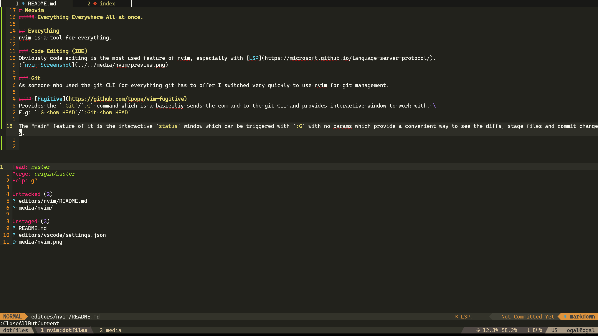
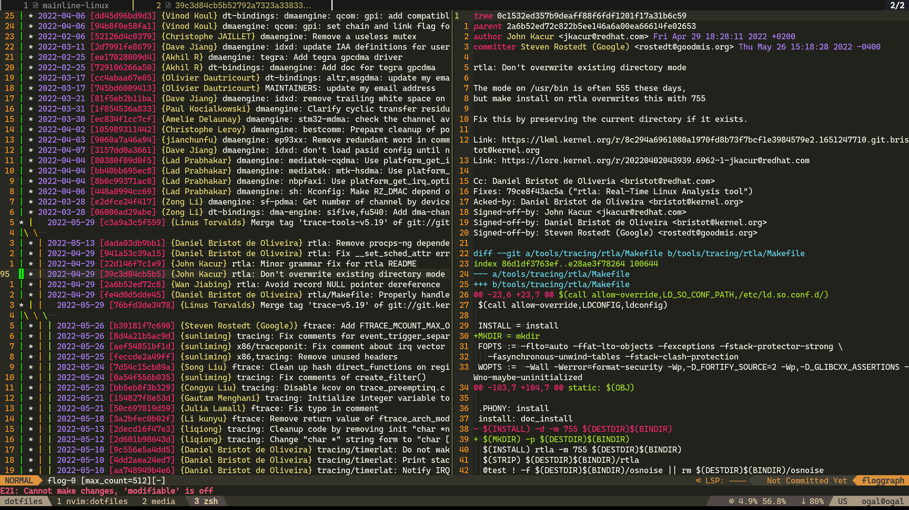
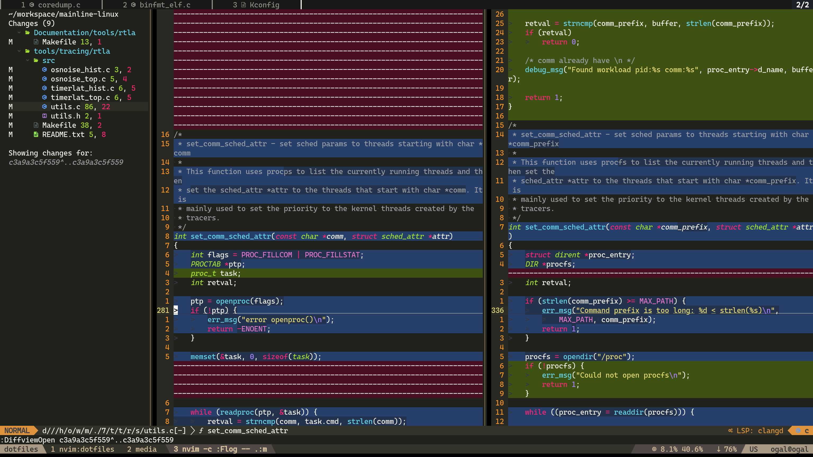
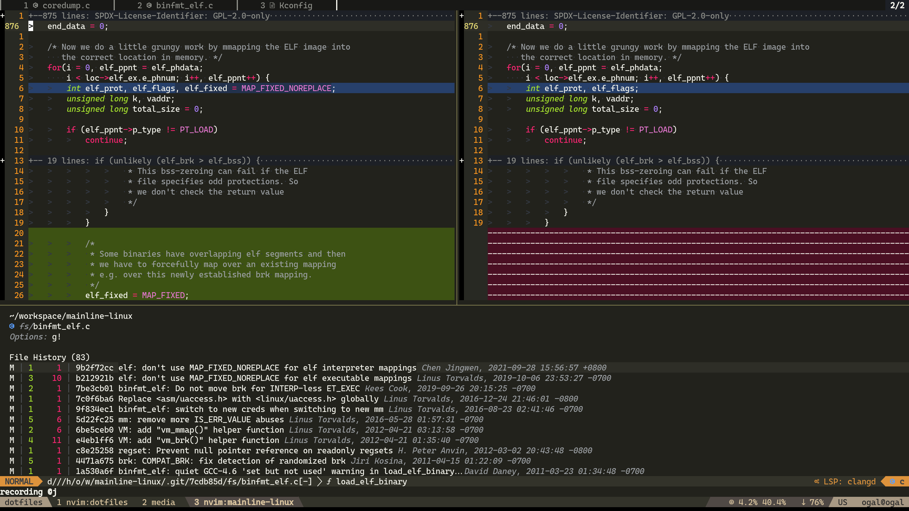
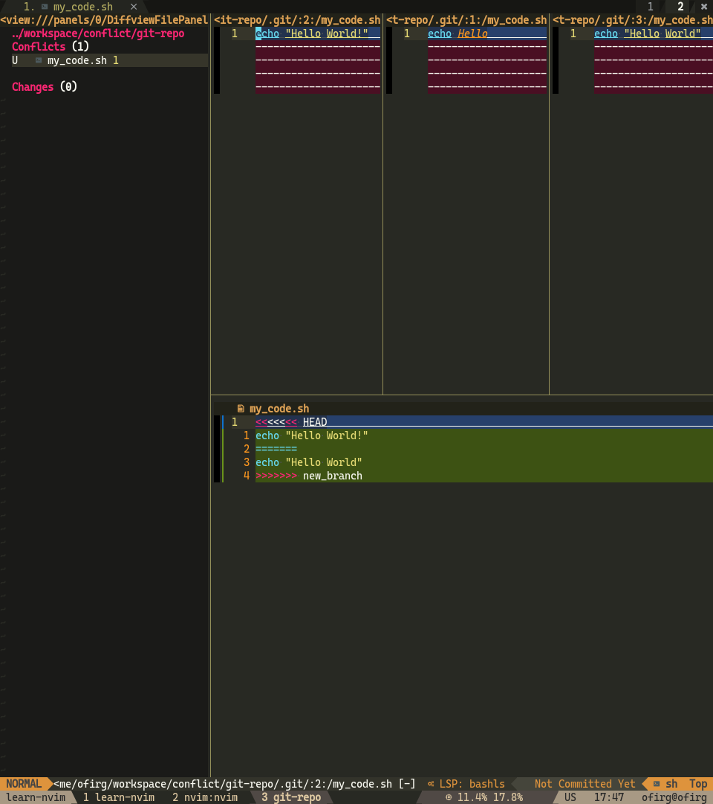
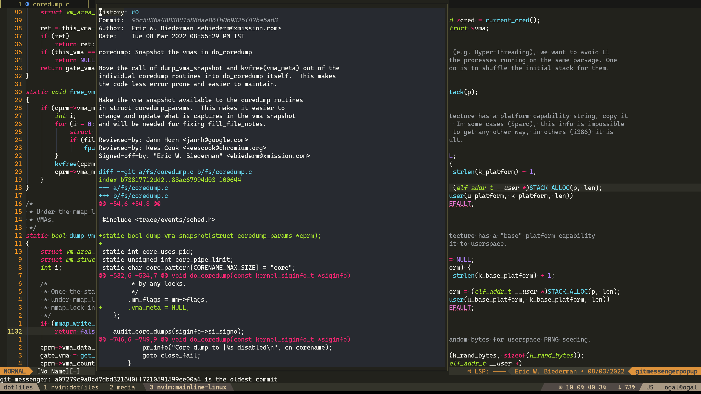

# Git
git이 제공하는 모든 기능을 위해 git CLI를 사용했던 사람으로서, 저는 git 관리를 위해 nvim을 사용하는 것으로 매우 빠르게 전환했습니다. \
nvim을 통해 git을 관리하는 데 사용하는 몇 가지 플러그인을 다룰 것이며, 그중 일부를 채택하는 것을 추천합니다.

---

## [Fugitive](https://github.com/tpope/vim-fugitive)
기본적으로 git CLI에 명령을 보내고 작업할 수 있는 대화형 창을 제공하는 `:Git`/`:G` 명령을 제공합니다. \
예: `:G show HEAD`/`:Git show HEAD`

이것의 "주요" 기능은 매개변수 없이 `:G`로 트리거할 수 있는 대화형 `status` 창으로, diff를 보고, 파일을 스테이징하고, 변경 사항을 커밋하는 편리한 방법을 제공합니다.

---

## [Gitsigns](https://github.com/lewis6991/gitsigns.nvim)
줄 번호 옆 열에 현재 diff를 표시하고, 헝크를 스테이징/되돌리기/미리보기/블레임할 수 있게 합니다.

---

## [Git blame](https://github.com/f-person/git-blame.nvim)
상태 표시줄이나 가상 텍스트에 현재 줄의 블레임을 표시합니다.

---

## Git 트리 (git log)
git 트리를 보기 위해 대화형 git 트리 뷰어를 제공하는 [vim-flog](https://github.com/rbong/vim-flog)를 사용합니다. \
커밋에서 엔터를 눌러 diff를 볼 수 있고, `ri`를 눌러 커밋에 대한 대화형 리베이스를 수행하는 등 많은 작업을 할 수 있습니다. \
매우 유용해서 `git hist`를 대체하는 별칭인 `ngh`를 만들었습니다. 이는 git 트리가 있는 새 nvim을 엽니다.

---

## Diffview
큰 diff를 쉽게 보기 위해 [diffview.nvim](https://github.com/sindrets/diffview.nvim)을 사용합니다.

파일의 기록을 보는 데도 사용합니다 (`keymap.lua`의 `<leader>gh`).

충돌을 해결하는 데도 사용합니다.

---

## 헝크 기록 (Hunk History)
이 코드가 왜 존재하는지 이해하기 위해 `git blame`을 시도했지만 마지막 커밋이 코드를 `들여쓰기`하거나 사소한 변경만 한 것을 본 적이 몇 번이나 있습니까? \
[git-messenger.vim](https://github.com/rhysd/git-messenger.vim)은 `헝크 기록`을 제공하여 이 문제를 해결합니다.

